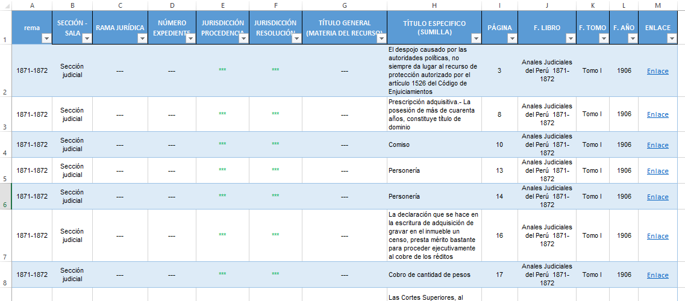

## Base de datos de las sentencias de la Corte Suprema de Justicia del Perú 1870-1972

Publicado: Enero 2023

En el prospecto del primer Repertorio Judicial[1], Toribio Pacheco recuperó el discurso del Presidente cesante de la Corte Superior de Cajamarca. Fue un 7 de enero de 1864 cuando el doctor Villaverde reflexionaba delante de la audiencia sobre la necesidad de la publicidad de los actos judiciales. 

Manifestó que "la mejor salvaguardia de los intereses individuales, así como la mejor garantía de los magistrados contra los embates de las pasiones creada por una injusta y ciega opinión. Tal vez no esté distante el tiempo en que todos los actos judiciales sean registrados por la prensa periódica: entónces, y solo entónces podrán los jueces ser juzgados á su vez por la Nacion, y se formará la verdadera jurisprudencia en nuestro país". 

Más allá de si la publicidad era un principio suficiente para la transparencia de los actos judiciales ante la ciudadanía, que evidentemente es un gran avance; era necesaria una recopilación de la jurisprudencia como herramienta para un trabajo más eficiente de los operadores de justicia. En ese sentido, Pacheco atribuye la creación del Repertorio Judicial como un "progreso de la patria", una obra de "trascendental importancia", y no se equivocaría.

Un hecho es seguro, esta primera obra sería el antecedente de las recopilaciones futuras que se elaborarían sobre la jurisprudencia nacional, desde la constitución de la República. Subsecuentemente, fueron en los **Anales judiciales del Perú** y los **Anales judiciales de la Corte Suprema de Justicia** en donde se materializaría dicho principio publicitario. Esta última obra aún vigente su publicación, aunque ya no con la misma acogida e intensidad que en los primeros años; pues, la publicación ya no solo es actividad del Estado, sino de académicos y empresas con distintos propósitos.

Es así que, el presente proyecto busca sistematizar y referenciar en una base de datos los títulos de las sentencias publicadas por la Corte Suprema de Justicia del Perú, durante 1870 y 1972. En este primer lanzamiento, la base de datos tuvo como fuente los Anales judiciales de la Corte Suprema de Justicia, que en 64 tomos aborda un poco más de 100 años de sentencias supremas. Esta herramienta pretende ser útil para los juristas e investigadores en lo que respecta a la Historia del Derecho peruano. 

[> Repositorio del proyecto](https://github.com/actio1680/Cuerpos-legales-Peru/tree/main/Sentencias-supremas/BD-AJCS-XX-XXI)

### CONTENIDO
**1. Base de datos de las sentencias de la Corte Suprema de Justicia**

**2. Documento XLSX**

---

### 1. BASE DE DATOS DE LAS SENTENCIAS DE LA CORTE SUPREMA DE JUSTICA
La obra principal para la confección de la base de datos fueron los primeros 64 tomos de los Anales judiciales de la Corte Suprema de Justicia, que comprenden los años judiciales de 1870 a 1972. Los tomos contienen sentencias escogidas por operadores de justicia y profesionales especializados en la materia; es decir, no todas las sentencias fueron publicadas en los, sino las más trascendentes.

La base de datos consta de las siguientes características:

 - **Año judicial:** Año de la publicación del tomo. 
 - **Sección - Sala** Área del derecho al que pertenece la sentencia suprema.
 - **Número expediente:** Identificador del expediente fuente de la sentencia suprema.
 - **Jurisdicción procedencia** Identifica la procedencia del expediente judicial. Se creó esta categoría porque durante el siglo XIX y XX las Cortes Supremas no estaban descentralizadas; por lo que muchas llegaban a la jurisdicción judicial de Lima, y para no perder la información de procedencia, se creo. 
 - **Jurisdicción resolución:** Jurisidicción judicial suprema en donde se resuelve y pública la sentencia.
 - **Título general (Materia del recurso):** Es la descripción de la temática del caso. 
 - **Título especifíco (Sumilla):** Es la descripción resumida del caso. 
 - **Página:** Número de página de la obra donde se ubica la sentencia suprema. 
 - **F. Libro:** La fuente del libro donde se extraen los títulos de la sentencia suprema. 
 - **F. Tomo:** La fuente del tomo donde se extraen los títulos de la sentencia suprema. 
 - **Enlace:** Conduce al almacenamiento virtual de la obra.

Respecto al contenido, se pinto de un color especifico y colocó un símbolo según la descripción siguiente: 
- Negro: Sin información en el documento. Símbolo ( --- ). 
- Verde: Con información en el documento, pero sin llenar. Símbolo ( *** ). Llenado progresivo.   
- Rojo: Creado por nosotros con base en las sentencias supremas para ayudar al lector de la base de datos. 

### 2. DOCUMENTO XLSX

|DOCUMENTO||
| --- | --- |
|Base de datos de las sentencias de la Corte Suprema de Justicia del Perú 1870-1972||
||[Descargar XLSX](https://github.com/actio1680/Cuerpos-legales-Peru/tree/main/Sentencias-supremas/BD-AJCS-XX-XXI)|

No todo el contenido esta volcado en el archivo, puesto que, aún se estan extrayendo los datos. Los datos secundarios, así que no afectan a la base de datos en general, sino que la complementan. Las categorías ejes fundamentales son el **Título general** y el **Título especifíco** porque según los modos de organizar las sentencias en cada período histórico ha sido distinta; así por ejemplo, mientras en la actualidad prima el código, antaño era o bien la sumilla o la materia. El archivo actualizado que tienenes de formato XLSX.

 

<i>San Juan de Miraflores, noviembre de 2025</i> 
(Última actualización)

[Subir](#top)

---
[1]: Corte Suprema. (1864). *Repertorio judicial: colección oficial de las resoluciones de la Corte Suprema de Justica*. [Enlace](https://books.google.com.pe/books?id=G-srAQAAMAAJ)

